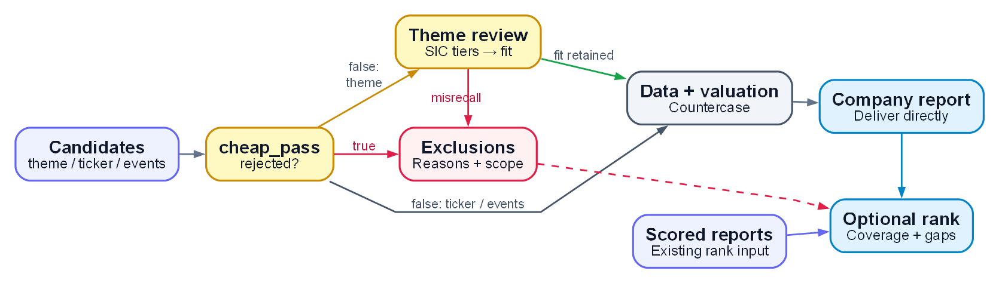

# small-cap-deepdive

Research small-cap and microcap US equities from SEC filings: discover candidates by theme or event, screen financial and disclosure risks, and prepare company reports for human due diligence.

[](https://docs.anthropic.com/en/docs/claude-code)
[](LICENSE)
[](#design-philosophy)
[](https://github.com/dgunning/edgartools)
[](#languages)
[](ROADMAP.md)

[English](README.md) | [中文版](README_CN.md)

---

## Design philosophy

Low analyst coverage alone does not establish undervaluation. The research hypothesis is that
a fundamental change can take time to reach market prices. The tool applies the same filing
checks and disconfirmation procedure to each admitted candidate so that company selection
depends on documented evidence. The rationale and empirical reference notes are in
[cognitive priors](reference/cognitive-priors.md).

Conservative eligibility rules can withhold a rating from a sound company when evidence is
missing or incompatible. Calculations require dated periods, compatible units and source
provenance. A high rank identifies a candidate for human diligence; it does not establish an
investment advantage. If no candidate reaches score 4, report the observed population,
missing work and coverage limits with that result. An empty shortlist cannot establish that
a theme has no suitable companies or investment opportunities.

[PHILOSOPHY.md](PHILOSOPHY.md) explains the data/judgment boundary, the reason for bundling
deterministic filing tools, consistent screening, and reference ownership.

---

## What it is (and isn't)

The skill accepts a theme, ticker, event route, or existing scored reports. Its stages are:

| Stage | Behavior and authoritative detail |
|---|---|
| Run allocation | `new_run.py` creates a PRIVATE report batch and `_run.json` with the source revision and valuation-config snapshot. See [Quick start](#quick-start). |
| Theme discovery | EDGAR FTS with optional `discover.py --sic-reverse` recall; unpriced candidates retain `band="unknown"`. [Discovery engine](reference/discovery-engine.md) defines scope and completion. |
| Mechanical screening | `cheap_pass.py` checks going concern, death-spiral convertibles, material weaknesses and concentration. Its `rejected` result determines admission; an individual flag can survive screening while blocking BUY. |
| Theme-fit review | Theme runs require SIC review followed by a bound LLM business review. Both SIC tiers continue; only `misrecall` is removed for theme fit. |
| Financial data | `deepdive_data.py` retrieves XBRL, insider trades and disclosure events, with debt, entity, period and source-integrity checks. [Mechanical checks](reference/mechanical-checks.md) and [data sources](reference/data-sources.md) define these guards. |
| Valuation | Reverse-DCF, EV/EBITDA, cyclical normalization and NAV use the applicable evidence. BUY requires `mos_basis∈{fcf_cap,nav}`, active MoS ≥ 30%, `buy_eligible == true`, zero kill-flags and no T3 thesis. The catalyst MoS waiver remains frozen. See [valuation](reference/valuation.md). |
| Judgment and reporting | The [rubric](reference/judgment-rubric.md) requires reference-class priors, disconfirmation, evidence tiers and a seven-dimension scorecard. Reports include data quality, unresolved work and optional ranking. |
| Forward tracking | `track_forward.py` records verdicts in PRIVATE `data/metrics/`, then scores mature outcomes against IWM with Brier and de-risk measures. See [tracking](reference/track-forward.md). |
| Diagnostics | `signals.py` records price divergence and ownership for future calibration. Diagnostic fields do not affect BUY eligibility. See [data sources](reference/data-sources.md). |

The tool targets companies with little or no analyst coverage. Factor/quant screening,
trading execution, portfolio management, large-cap coverage and automatic investment
decisions are outside its scope. Filing-derived data is not real time (a typical filing
lag is 1 to 4 days); market prices and other convenience data have separate source limits.
Reports support human decisions. Historical research scripts are described in the
[documentation index](docs/README.md); they do not establish a factor strategy.

### Evidence and evaluation

Real-run observations and research reports belong in the initialized, versioned PRIVATE
companion. The public tool contains generic methodology and generated synthetic fixtures.
See [evidence status](docs/evidence-status.md) for the limits of review, synthetic controls,
current execution, and historical research.

CORE-4 is a policy sum of four binary distress flags, with range 0 to 4. A fixed score
threshold, a per-year ranking, and a train/test logistic model are different evaluations.
Predictive performance requires a dated eligible population, complete scope and provenance,
and a freshly executed evaluation. A zero-BUY output does not establish market efficiency
or the absence of investment opportunities.

---

## Research workflow

<p align="center">
  <a href="docs/diagrams/workflow-en.png">
    
  </a>
</p>

[DOT source](docs/diagrams/workflow-en.dot) · [Rendering script](docs/diagrams/render.py)

Only `theme` uses the SIC and theme-fit stages; both SIC `keep` and `review` tiers
retain the candidate. Theme-fit review removes only `misrecall`.
Mechanical screening follows `cheap_pass`'s `rejected` result: a single
risk flag does not necessarily eliminate a company.

A single-company report can be delivered directly; optional ranking also accepts
existing scored reports. Both outputs support human due diligence.

Deep-dive still requires the applicable admission, band and completion checks;
missing work remains visible. Diagnostic `signals` supply research context only,
never set BUY eligibility or execute trades. Details are in the
[entry workflows](SKILL.md#four-entry-workflows).

## Install

```
/plugin install github:DaizeDong/small-cap-deepdive
```

Or clone manually:

```bash
git clone --recurse-submodules https://github.com/DaizeDong/small-cap-deepdive.git ~/.claude/plugins/small-cap-deepdive
```

Then install the data-layer dependencies and configure once:

```bash
cd ~/.claude/plugins/small-cap-deepdive
pip install -r tools/requirements.txt
gh repo create small-cap-deepdive-config --private --add-readme
gh repo clone small-cap-deepdive-config ~/.small-cap-deepdive-config
export SMALL_CAP_DEEPDIVE_CONFIG_DIR="$HOME/.small-cap-deepdive-config"
python scripts/init_config.py
```

Open `~/.small-cap-deepdive-config/config.json` and set `"sec_user_agent"` to your real name and email:

```json
"sec_user_agent": "AcmeCorp user1@example.com"
```

This is the only required field. EDGAR requires a valid `User-Agent` header on every request
(SEC policy). Omitting it or using a fake value causes 403 errors from `efts.sec.gov`.

Note the config lives **outside** the repo. That is deliberate: `sec_user_agent` is your real name
and email, and this is a public repo. There is no in-repo config location any more, and the tools
refuse to create one.

To use the skill from Claude Code via a junction (Windows) or symlink instead of `/plugin install`:

```powershell
# Run from the clone directory in an ordinary user PowerShell session.
$repoRoot = (Resolve-Path -LiteralPath (git rev-parse --show-toplevel)).Path
if (-not (Test-Path -LiteralPath (Join-Path $repoRoot 'SKILL.md'))) { throw 'SKILL.md missing' }
$skillAlias = Join-Path $env:USERPROFILE '.claude/skills/small-cap-deepdive'
New-Item -ItemType Directory -Force -Path (Split-Path -Parent $skillAlias) | Out-Null
New-Item -ItemType Junction -Path $skillAlias -Target $repoRoot | Out-Null
if (-not (Test-Path -LiteralPath (Join-Path $skillAlias 'SKILL.md'))) { throw 'Skill alias failed' }
```

```bash
# macOS / Linux, from the clone directory
repo_root="$(git rev-parse --show-toplevel)"
test -f "$repo_root/SKILL.md" || exit 1
mkdir -p "$HOME/.claude/skills"
skill_alias="$HOME/.claude/skills/small-cap-deepdive"
ln -s "$repo_root" "$skill_alias"
test -f "$skill_alias/SKILL.md" || exit 1
```

---

## Config

[CONFIG.md](CONFIG.md) owns field definitions, DATA/CONFIG precedence, destination proof,
profile switching and retention. Configuration, reports and tracking share a verified
PRIVATE companion. Each alternate profile must select a separate Git worktree root;
nested profiles are refused. Missing configuration or unproved visibility stops writes.

After initialization, set the private `sec_user_agent` value and run:

```bash
python scripts/verify_config.py --json
```

A blank or example identity returns NOT READY. The doctor checks local configuration,
destination proof and dependencies; live SEC, market and model readiness requires separate
verification. Commit and push configuration and runtime DATA in the PRIVATE companion.
The 64 MiB storage threshold requires dependency review when exceeded and never authorizes
discarding protected records. See [retention](CONFIG.md#companion-storage-and-retention).

---

## Quick start

Allocate a batch with `python tools/new_run.py --label <name> [--input-hash <SHA256>]` and set `SMALLCAP_RUN` to its stdout. Each call creates an exclusive directory beneath the PRIVATE reports root, using a date, encoded label and random identifier. Repeated labels never overwrite an earlier run. With no active run, reports use the unbatched root.

Resume explicitly with `--resume <RUN_ID> --input-hash <SHA256>`. The manifest's input hash, run identity and configured reports root must match before any mutation; successful resume preserves existing bytes. For compatible allocations without a supplied hash, the tool hashes canonical JSON containing the label, note and nonsecret valuation config snapshot; `tools/new_run.py` documents the exact encoding.

Output destinations and SSH-origin verification follow [CONFIG.md](CONFIG.md#secrets--pii-mode-b-e6).

There are four entry modes.

### 1. Theme run, full universe screen

For a ranked shortlist of small-cap pure-plays in a theme:

```
/small-cap-deepdive theme "railcar leasing"
```

Full step-by-step: **[runbooks/theme-run.md](runbooks/theme-run.md)**

Expected token budget: ~300k tokens, ~$0.30, 1 to 3 hours for a niche theme.

### 2. Single-ticker deep-dive

For a rigorous report on a company you already know:

```
/small-cap-deepdive ticker <ticker>
/small-cap-deepdive ticker <ticker> --theme "SaaS for regulated industries"
```

Full step-by-step: **[runbooks/single-deepdive.md](runbooks/single-deepdive.md)**

Expected token budget: ~10k to 15k tokens per company, <$0.02.

### 3. Re-rank existing scores

To re-sort a prior run's scored reports without re-running discovery:

```bash
python tools/rank.py --output RANKING-rerun-01.md
python tools/rank.py --slug railcar --output RANKING-railcar-rerun-01.md
python tools/rank.py --input "<private-companion>/reports/smallcap/<run>" --output RANKING-rerun-02.md
```

Choose a fresh output basename for each re-rank. Existing ranking artifacts are preserved.

The default uses existing reports in the configured PRIVATE companion and active run;
re-ranking does not create a research batch. Explicit inputs must select an existing
report directory. [CONFIG.md](CONFIG.md#secrets--pii-mode-b-e6) defines the local
PRIVATE receipt check and refusal of filesystem aliases before output is written.

Full step-by-step: **[runbooks/batch-rank.md](runbooks/batch-rank.md)**

Expected token budget: Zero, deterministic, no LLM calls.

### 4. Event-driven discovery, spinoffs or insider clusters

For theme-independent discovery via structural catalysts (forced trading):

```bash
# Enumerate recent spinoff registrations (Form 10-12B)
python tools/discover_events.py --spinoffs

# Enumerate cluster open-market insider buys (openinsider)
python tools/discover_events.py --insider-clusters
```

These routes enumerate forced-trading or insider-conviction candidates. Mechanisms and
source limitations are described in
[`reference/event-driven.md`](reference/event-driven.md).

Events skip the theme-fit gates. Source validation and the kill-flag scan remain mandatory (`cheap_pass.py --universe <candidates_event_*.json>`). Pre-listing spinoffs
(no ticker yet) are processed via CIK, in the `band="unknown"` cohort.

Expected token budget: ~300k tokens for a full event-mode run with deep-dives.

---

## How to invoke

Use the slash command in any mode, e.g. `/small-cap-deepdive theme "railcar leasing"` or
`/small-cap-deepdive ticker <ticker>`. Or trigger it with natural language in any Claude Code
session:

```
Run small-cap-deepdive on the theme "railcar leasing"
Deep-dive <ticker> as a small-cap with small-cap-deepdive
Screen the small-cap SEC universe for "industrial water treatment"
```

The skill triggers on small-cap / microcap value research, thematic stock screening, and
single-company deep DD. It does **not** trigger for large-cap / sell-side coverage,
factor/quant screening, trading signals, or execution.

---

## Example output

Each candidate is rated mechanically. The scorecard quick reference:

| Score | Meaning | Action |
|---|---|---|
| 4 to 5 | Survived all gates, real theme exposure, no structural red flags | Merits full human diligence |
| 3 | Borderline, one weak dimension | Read dimension detail before deciding |
| 1 to 2 | Hard-rule ceiling applied | Named structural problem; do not invest without resolving it |
| Eliminated | `cheap_pass` returned `rejected=true` | Stop, do not re-examine |

The rating is mechanical: `rating = f(MoS / NAV-MoS, kill-flags, hard-ceilings, buy_eligible)`. The
7-dimension scorecard is a diagnostic `/35` summary (no hidden weights), not the rating driver; hard
ceiling rules override narrative quality. Full rubric: `reference/judgment-rubric.md`.

A theme run finalizes into deterministic per-ticker reports plus a `RANKING.md` with funnel
counts, kill-flag eliminations, and coverage gaps.

### Architecture

```
bundled data layer (deterministic Python — never makes investment judgments)
  tools/_common.py       — config, EDGAR session, per-tool sleep + http_get retry/backoff, batch routing
  tools/new_run.py       — open a timestamped run batch + _run.json manifest
  tools/discover.py      — EDGAR FTS enumeration + SIC reverse-recall + mktcap fallback
  tools/filter_by_sic.py — Gate 1 SIC review tier + SIC reverse-recall floor (LIBRARY; CLI is --selftest only)
  tools/cheap_pass.py    — mechanical kill-flags from SEC filings (incl. concentration)
  tools/deepdive_data.py — XBRL + Form 4 + shelf status + data-integrity guards + second-source check
  tools/valuation.py     — reverse-DCF / NAV / EV-EBITDA + the buy_eligible mechanical gate
  tools/discover_events.py — event-driven discovery (spinoffs / insider clusters)
  tools/finalize_run.py  — deterministic run-finalizer (reports + verdicts + RANKING)
  tools/make_report.py   — deterministic report scaffolder + data-quality trust banner
  tools/rank.py          — deterministic scoring and ranking
  tools/track_forward.py — verdict log, Brier vs IWM, de-risk metrics, recall@gold
  tools/run_theme.py     — end-to-end theme driver (calls the above)

diagnostic side-channel (firewalled — recorded, never drives BUY)
  tools/signals.py       — price-divergence (P16) + ownership (P17); measures the diffusion thesis

thin judgment layer (LLM — reads JSON, applies rubric, never computes financials)
  SKILL.md          — orchestration + world-view + hard rules
  reference/*.md    — methodology invariants (single source of truth)
  workflows/theme-fit-gate.js  — required host workflow for theme Gate 2
  workflows/deepdive-fanout.js — required for theme runs; optional for standalone DD
```

The deterministic layer supplies financial data and eligibility checks. The judgment layer
reads that output and applies the rubric without computing financials. Diagnostic `signals`
remain outside `valuation.py`, `buy_eligible` and the BUY trigger. The rationale and historical
development context are in [PHILOSOPHY.md](PHILOSOPHY.md).

---

## Limitations

**Dependencies.** No proprietary dependencies; no API keys required for the core data layer.

| Package | License | Purpose |
|---|---|---|
| [edgartools](https://github.com/dgunning/edgartools) | MIT | EDGAR FTS, XBRL parsing, Form 4 retrieval |
| yfinance | Apache 2.0 | Market cap / price convenience layer |
| pandas | BSD | Data processing |
| requests | Apache 2.0 | HTTP with EDGAR rate discipline |

**market-intel (optional read-only reuse):** When the `market-intel` skill is installed, the
judgment layer reads its source catalog to route qualitative research (X sentiment, industry
news, competitor web presence) to the best available MCP tool. The market-intel skill is never
invoked as a skill at runtime, the catalog is read as documentation. Full anti-recursion
design: `reference/data-sources.md §market-intel`.

**Insider-source availability:** The default `insider_source` uses OpenInsider.
A failed or incomplete observation remains unavailable with its reason. EDGAR Form 4 mode
is an unsupported stub (`available: false`); there is no implemented automatic EDGAR fallback.
See `reference/data-sources.md` for the current source contract.

**Workflow host requirement:** `workflows/theme-fit-gate.js` and
`workflows/deepdive-fanout.js` consume bound requests through a configured Workflow host.
Natural-language orchestration can prepare those requests, but each stage remains incomplete
until its bound host result is ingested. The JavaScript files are not direct Node entry points.

**X sentiment routing:** When X/Twitter sentiment is requested for a ticker, the skill routes
to twitterapi.io (resale API) if the key is configured via the market-intel companion
config. If unavailable, it falls back to search-engine-indexed X posts. The user's personal
X/Twitter account is never used (account suspension risk).

---

## Languages

English (`README.md`, authoritative) · 中文 ([`README_CN.md`](README_CN.md))

---

## Roadmap · Contributing · License

See [ROADMAP.md](ROADMAP.md) · [PHILOSOPHY.md](PHILOSOPHY.md) · [CHANGELOG.md](CHANGELOG.md) · [LICENSE](LICENSE) (MIT).

Contributing: see [PHILOSOPHY.md](PHILOSOPHY.md) and the [documentation index](docs/README.md) for architectural invariants. The core invariant
is the data/judgment boundary: the data layer (`tools/*.py`) never produces investment judgment;
the judgment layer never computes financials. Changes that blur this boundary require explicit
justification in [PHILOSOPHY.md](PHILOSOPHY.md).
