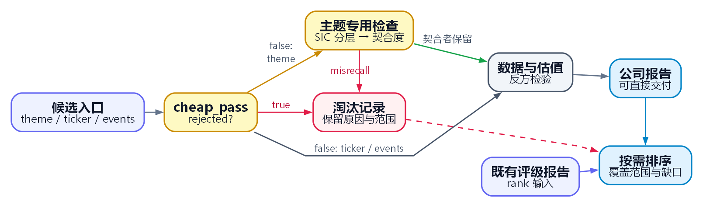

# small-cap-deepdive

机械化排雷 SEC 小盘股全库，给定主题或 ticker，先排掉地雷，再深挖幸存者。

[](https://docs.anthropic.com/en/docs/claude-code)
[](LICENSE)
[](#设计理念)
[](https://github.com/dgunning/edgartools)
[](#语言)
[](ROADMAP.md)

[English](README.md) | [中文版](README_CN.md)

---

## 设计理念

**被忽视 ≠ 被低估。**

缺少分析师覆盖本身不能证明价格有误。基本面变化是否存在信息扩散延迟，需要另行核实。工具先按明确规则排查财务和申报风险，再把有证据支持的候选交给人工尽调。

**产出是避雷扫描器，不是买入清单。**

排名靠前的公司意味着它通过了所有淘汰门、有真实的主题敞口、值得完整人工尽调，不代表买入。这个工具的核心价值，在于它**排除**了什么：持续经营疑虑的候选、死亡螺旋的稀释者、不正常申报的公司，这些在任何判断动用之前就已被挡在门外。

**零买入需要结合筛选范围和数据覆盖解释。**

某主题没有产出 4 分以上候选，只说明本次观察到的候选在当前规则下没有达标。它不能证明该主题没有合适公司，也不能证明市场定价有效或事件路线更有优势。报告应同时说明候选范围、缺失数据、失败步骤和人工干预。

一句话：**工具的 edge 是机械纪律一致地施加于全量候选，而非对某家公司的叙事综合。** 本仓库里的每个工具、每个不变量、每条硬规则，都源于四条原则，改根因（不打补丁）、Hybrid 而非 thin（数据层有其存在价值）、纪律即护城河、`reference/` 单一真相源。

保守的资格规则也有代价：一家经营正常的公司，可能因证据缺失或口径不兼容而无法获得评级。
因此，计算前必须核对日期、财务期间、单位和来源，报告必须保留未完成步骤及检索范围。
通过这些检查，只能说明候选满足已声明的筛选条件；预测能力还需要针对有明确日期和范围的总体单独评估。

📜 **[阅读完整设计哲学 → PHILOSOPHY.md](PHILOSOPHY.md)**

---

## 它是什么（不是什么）

给定一个投资主题或一个 ticker，skill 自 SEC 申报全库枚举候选，施加机械避雷硬规则，以强制反方为前提做可证伪的深度尽调，并对幸存候选排序。逐步拆解：

0. **开运行批次**（`new_run.py`）：每次运行写入已初始化 PRIVATE 伴生仓的 `reports/smallcap/<日期>_<label>/`，附 `_run.json` manifest（skill git commit + 估值 config 快照），便于按版本对比。分配失败时先退出，成功后再导出返回的运行标识：

   ```bash
   SMALLCAP_RUN="$(python tools/new_run.py --label "Synthetic research")" || exit 1
   export SMALLCAP_RUN
   ```

1. **枚举 SEC 全库**：用 EDGAR 全文检索（FTS），可选 UNION 一个 **SIC 反向召回底**（`discover.py --sic-reverse`，内部调用 `filter_by_sic.py`）,对有专属 SIC 码的主题，枚举该 SIC 下全部注册人，避免漏掉低关键词密度的真实成员；该召回底按主题 opt-in。市值用 fallback 链解析（yfinance 为空时用 SEC 股数×价格）；仍无法定价的归 `band="unknown"` 流过，而非静默丢弃。

2. **机械避雷**（`cheap_pass.py`）：直接读 SEC 申报的硬红线，持续经营审计段、死亡螺旋可转债、内控重大缺陷、magnitude 级客户/政府单一项目集中度。按返回的 `rejected` 判定是否淘汰；单一风险标记不必然淘汰，`rejected=true` 的公司不进入判断。

3. **两阶段精度门（强制）**：门 1（`filter_by_sic.sic_classify`，由 `run_theme.py` 内联调用）：SIC **复核层**，不是排除层。命中硬排除 SIC 的公司被标为 `sic_tier="review"`，**仍然进入门 2**；门 1 永不丢弃任何公司。门 2（LLM）：读每家公司 10-K 业务描述，判 `pure_play / partial / misrecall`，丢弃 `misrecall` 是全流程中唯一一次按主题契合度剔除。典型失败案例：用 `refractory`（难治性）作为铁路车厢隔热主题关键词，FTS 拉回整个肿瘤 biotech 板块，零家铁路公司，而门 1 把它们全部放行了，因为 pharma SIC 只会拿到 `review`。召回用 `recall@gold`（对照手工真实成员清单）**度量**,而非假设。

4. **取数**（`deepdive_data.py`）：XBRL 财务序列（含 EBIT 概念级联、债务与股数 fallback）、Form 4 内部人交易、货架/ATM 状态、稀释历史、重大事件时间线。数据完整性守卫：债务截断、错误实体、低营收巨亏比、以及**二次源交叉校验**（SEC vs yfinance，>2.5× 分歧即标记并阻断 BUY）。

5. **估值 + 机械 `buy_eligible` 门**（`valuation.py`）：反向 DCF（标准化 FCF）、EV/EBITDA 倍数、周期底部 EBITDA 标准化、重资产 NAV 路径。买入要求 `mos_basis∈{fcf_cap,nav}` 且 安全边际 ≥ 30% 且 **`buy_eligible == true`** 且 零 kill-flag 且 无 T3 核心论据。`buy_eligible` 与入全部守卫，极端 MoS、大盘上限、FCF 可持续性、金融-SIC/保险排除、债务截断、二次源分歧、集中度 kill,以及 **V 形价值陷阱否决**（`fundamental_decline_flag` 单调下滑 + `peak_contamination_flag` 谷→峰→回落）。催化剂修正当前冻结为 WATCH（待机制校准）。

6. **强制反方判断**：评分前先锚定基准概率，对每个候选强制反方 WebSearch，7 维评分卡配硬上限规则。证据按 Tier 标注（T1 第一方 SEC 申报 / T2 独立第三方 / T3 公司自述）；T3 证据不得作为买入支撑。

7. **收尾 + 排序**（`finalize_run.py`、`make_report.py`、`rank.py`）：确定性逐票报告，每个评级下附数据质量**信任 banner**,自动生成 verdict 喂入 track-forward,并产出 `RANKING.md`（漏斗计数、淘汰原因、数据盲区）。

8. **前向校准**（`track_forward.py`）：verdict 记入 `<私有数据目录>/metrics/verdicts.jsonl`（由 `guards/tools/datadir.py` 解析到**仓库之外**，绝不落回仓内；仓内只带 `metrics/verdicts.jsonl.example` 作为 schema）,到期对 IWM 做 Brier 评分，含 de-risk 指标（避免暴雷/下行捕获）。

9. **诊断信号，防火墙隔离**（`signals.py`）：严格诊断的侧信道，度量"延迟信息扩散"立论，**价格背离**（基本面轨迹 vs 滚动价格回报 → `unpriced_improvement` / `melting_ice_cube_priced` / `aligned`）与**持仓**（13D/13G + 做空)。它**永不**触碰 `buy_eligible` 或买入决策，仅记录供未来 per-signal 校准。

**它不做什么：**

- 多因子/量化选股或回测，实证证明扣除交易成本后因子 alpha 消失，这个决策空间不进本工具。
- 交易信号、执行或组合管理。
- 实时行情，所有数据来自 SEC 申报，典型延迟 1 to 4 天。
- 大盘或卖方覆盖较多的公司；工具面向缺少分析师覆盖的小盘和微盘公司。
- 自动买入建议，每份输出以"值得人工尽调"结尾，不以"买入"结尾。

### 证据与评估

真实运行记录和研究报告保存在已初始化、纳入版本管理的 PRIVATE 伴生仓。
公开工具只提供通用方法和生成的合成样例。[证据状态](docs/evidence-status.md)
区分源码审查、合成检查、当前执行和历史研究各自能说明什么。

CORE-4 是四个二元困境指标之和，取值为 0 到 4。固定分数门槛、逐年排序和
训练集/测试集逻辑回归属于不同的评估方法。绩效结论需要有日期的资格证据、
完整范围和数据来源，以及重新执行的评估。没有 BUY 输出不能证明市场有效或没有投资机会。

---

## 研究流程

<p align="center">
  <a href="docs/diagrams/workflow-cn.png">
    
  </a>
</p>

[DOT 源码](docs/diagrams/workflow-cn.dot) · [绘图脚本](docs/diagrams/render.py)

只有 `theme` 经过 SIC 与主题契合度复核；SIC 的 `keep`、`review` 两层均保留候选。
主题契合度只淘汰 `misrecall`。
机械筛查以 `cheap_pass` 返回的 `rejected` 为准：单一风险标记不必然淘汰公司。

单公司报告可直接交付；排序按需进行，也可读取既有评级报告。两种输出都供人工尽调使用。

尽调仍须满足相应的准入、市值分层和步骤完成检查；未完成工作会保留在报告中。
诊断 `signals` 仅供研究参考，不设置 BUY 资格，也不执行交易。
详细步骤见[入口流程](SKILL.md#four-entry-workflows)。

## 安装

```
/plugin install github:DaizeDong/small-cap-deepdive
```

或手动克隆：

```bash
git clone --recurse-submodules https://github.com/DaizeDong/small-cap-deepdive.git ~/.claude/plugins/small-cap-deepdive
```

然后安装取数层依赖并一次性配置：

```bash
cd ~/.claude/plugins/small-cap-deepdive
pip install -r tools/requirements.txt
gh repo create small-cap-deepdive-config --private --add-readme
gh repo clone small-cap-deepdive-config ~/.small-cap-deepdive-config
export SMALL_CAP_DEEPDIVE_CONFIG_DIR="$HOME/.small-cap-deepdive-config"
python scripts/init_config.py
```

打开 `~/.small-cap-deepdive-config/config.json`，将 `"sec_user_agent"` 设为你的真实姓名和邮箱：

```json
"sec_user_agent": "AcmeCorp user1@example.com"
```

这是唯一必填字段。EDGAR 要求每次请求带有效 `User-Agent` 头（SEC 政策），缺失或使用假值会导致 `efts.sec.gov` 返回 403。

注意 config 位于**仓库之外**，这是刻意的：`sec_user_agent` 是你的真实姓名和邮箱，而这是一个公开仓库。
仓内已不存在任何 config 位置，工具也会拒绝在仓内创建。

若不走 `/plugin install`，也可建立 junction/symlink 部署为 Claude Code skill：

```powershell
# 在克隆目录内运行，普通用户 PowerShell 即可，无需管理员权限。
$repoRoot = (Resolve-Path -LiteralPath (git rev-parse --show-toplevel)).Path
if (-not (Test-Path -LiteralPath (Join-Path $repoRoot 'SKILL.md'))) { throw 'SKILL.md missing' }
$skillAlias = Join-Path $env:USERPROFILE '.claude/skills/small-cap-deepdive'
New-Item -ItemType Directory -Force -Path (Split-Path -Parent $skillAlias) | Out-Null
New-Item -ItemType Junction -Path $skillAlias -Target $repoRoot | Out-Null
if (-not (Test-Path -LiteralPath (Join-Path $skillAlias 'SKILL.md'))) { throw 'Skill alias failed' }
```

```bash
# macOS / Linux，在克隆目录内运行
repo_root="$(git rev-parse --show-toplevel)"
test -f "$repo_root/SKILL.md" || exit 1
mkdir -p "$HOME/.claude/skills"
skill_alias="$HOME/.claude/skills/small-cap-deepdive"
ln -s "$repo_root" "$skill_alias"
test -f "$skill_alias/SKILL.md" || exit 1
```

---

## 配置

`small-cap-deepdive` 是**带 config 的 skill**, 每个工具从一份 JSON 配置读取调参和唯一必填的 EDGAR
身份（`sec_user_agent`）。逐字段完整规范见 [CONFIG.md](CONFIG.md)。

- **配置发现：** 通过固定版本的 `guards/tools/datadir.py` 选择伴生仓。
  DATA 选择优先，其次为 `SMALL_CAP_DEEPDIVE_CONFIG`、`SMALL_CAP_DEEPDIVE_CONFIG_DIR`，
  也支持解析器约定的相邻伴生仓和主目录位置。选中的目录必须属于可验证为 PRIVATE 的 Git 仓库，
  并包含 `config.json`。缺少配置或无法确认可见性时，工具报错，不改用其他输出目录。
- **首次配置：**
  ```bash
  python scripts/init_config.py      # 先验证已存在的私有伴生仓，再生成配置
  # 编辑该 config.json：把 "sec_user_agent" 设为你的真实姓名+邮箱（唯一硬性必填）
  python scripts/verify_config.py --json  # 检查本地配置、私有输出目录和依赖
  ```
- **切换 config（即插即用）：** 把环境变量指向另一个 config 目录即可， config 自包含（`output_dir`
  相对于已验证的私有伴生仓）。每个配置目录都必须位于已经存在的 PRIVATE Git 工作树内。
- **密钥 / PII：** `config.json` 和运行 DATA 保存在已核验的 PRIVATE 伴生仓中，纳入版本管理，
  与公开工具源码分开。工具仓的忽略规则只是兜底，不能代替私有边界、版本历史和备份。
  初始化和配置检查会拒绝公开工具仓内的配置目标，并核验所有远端的读取和推送地址；
  公开或无法确认可见性时均停止写入。配置与运行数据在 PRIVATE 伴生仓中提交并推送。
  上面的身份是合成示例，真实运行前只在私有配置中替换。

---

## 快速开始

先用 `python tools/new_run.py --label <名称> [--input-hash <SHA256>]` 创建批次，将输出的名称设为 `SMALLCAP_RUN`。每次调用都在私有报告根目录下创建独立目录，名称包含日期、编码后的标签和随机标识；同名调用也不会覆盖旧批次。未设置 `SMALLCAP_RUN` 时，报告直接写入该根目录。

恢复批次需显式传入 `--resume <RUN_ID> --input-hash <SHA256>`。工具会先核对清单中的输入哈希、目录名称和报告根目录；不匹配时退出，不改动已有文件。新批次未传哈希时，会对标签、备注和非敏感估值配置快照的规范 JSON 计算 SHA256，具体格式见 `tools/new_run.py`。

报告、回测和运行状态都存入已验证为 PRIVATE 的 Git 伴生仓。`output_dir` 的相对路径以该伴生仓为起点；绝对路径和 `SMALLCAP_OUTPUT_DIR` 也须通过相同检查。`make_report.py --out` 可以指向另一个已验证的私有伴生仓。doctor 只检查本地配置与依赖，不代表 SEC、行情或模型服务已通过实测。

所有远端的读取和推送地址都必须验证为 PRIVATE。SSH 检查也会处理字面 `github.com` 的本地 `HostName` 重写；包含 `Include`、`Match` 或主机名规范化规则时，改用字面 HTTPS GitHub 地址。已有输出文件如果是硬链接，工具会拒绝使用。

共有四种入口模式。

### 1. 主题跑，全库筛选

获取某主题的小盘纯玩家排名：

```
/small-cap-deepdive theme "铁路车厢租赁"
/small-cap-deepdive theme "railcar leasing"
```

完整步骤：**[runbooks/theme-run.md](runbooks/theme-run.md)**

预计 token 预算：~30 万 token，约 $0.30，小众主题约 1 to 3 小时。

### 2. 单只票深度尽调

对已知公司做严格的可证伪报告：

```
/small-cap-deepdive ticker <ticker>
/small-cap-deepdive ticker <ticker> --theme "合规行业 SaaS"
```

完整步骤：**[runbooks/single-deepdive.md](runbooks/single-deepdive.md)**

预计 token 预算：~1 to 1.5 万 token，<$0.02。

### 3. 批量重排已有评分

不重跑发现和尽调，对已有输出换权重或重排：

```bash
python tools/rank.py --output RANKING-rerun-01.md
python tools/rank.py --slug railcar --output RANKING-railcar-rerun-01.md
python tools/rank.py --input "${REPORTS_ROOT}" --output RANKING-rerun-02.md
```

每次重排都要选一个尚不存在的输出文件名；工具会保留已有的排序文件。

`REPORTS_ROOT` 须先按主题运行手册初始化，指向已验证的 PRIVATE 伴生仓内的绝对路径。

完整步骤：**[runbooks/batch-rank.md](runbooks/batch-rank.md)**

预计 token 预算：零，纯确定性计算，无 LLM 调用。

### 4. 事件驱动发现，分拆或内部人集群

用结构性催化剂（强制交易）而非主题关键词来发现被误定价的小盘股：

```bash
# 枚举近期分拆注册（Form 10-12B）
python tools/discover_events.py --spinoffs

# 枚举集群公开市场内部人买入（openinsider）
python tools/discover_events.py --insider-clusters
```

分拆催化剂：母公司的被动指数基金持有人被迫卖出子公司股票（不在指数范围内），
产生短暂供给过剩、无自然接盘者。

内部人集群催化剂：多名内部人在公开市场用个人资金买入，是可获取的最硬管理层
信心信号（Form 4，公开市场现金购买，不含期权行权）。

无需主题适配门，表单类型枚举本身即为精确过滤器。Kill-flag 扫描仍然强制执行
（`cheap_pass.py --universe <candidates_event_*.json>`）。未上市的分拆子公司（暂无
ticker）通过 CIK 处理，归入 `band="unknown"` 队列。

预计 token 预算：含全量尽调约 30 万 token。

---

## 如何触发

任意模式用 slash 命令，例如 `/small-cap-deepdive theme "铁路车厢租赁"` 或
`/small-cap-deepdive ticker <ticker>`。或在任何 Claude Code 会话里用自然语言触发：

```
对"铁路车厢租赁"主题跑 small-cap-deepdive
用 small-cap-deepdive 把 <ticker> 当小盘股深挖
对"工业水处理"主题筛 SEC 小盘股全库
```

skill 触发于小盘/微盘价值研究、主题选股、单公司深度尽调。它**不**触发于大盘/卖方覆盖、
多因子/量化选股、交易信号或执行。

---

## 示例输出

每个候选机械化评级。评分速查：

| 分数 | 含义 | 行动 |
|---|---|---|
| 4 to 5 | 通过全部门，真实主题敞口，无结构性红线 | 值得完整人工尽调 |
| 3 | 边界，某一维度偏弱 | 读维度详情后再决定 |
| 1 to 2 | 硬上限规则生效 | 存在已命名的结构性问题；在解决前不应投资 |
| 已淘汰 | cheap_pass 返回 `rejected=true` | 停止，不必重新审查 |

评级是机械的：`rating = f(MoS / NAV-MoS, kill-flags, 硬上限, buy_eligible)`。7 维评分卡是诊断性 `/35` 汇总（无隐藏权重）,不是评级驱动；硬上限规则凌驾于叙事质量之上。完整评分卡：`reference/judgment-rubric.md`。

主题跑收尾产出确定性逐票报告，外加 `RANKING.md`（漏斗计数、淘汰原因、数据盲区）。

### 架构

```
取数层（确定性 Python，只摆数据，永不做投资判断）
  tools/_common.py       — 配置、EDGAR session、per-tool sleep + http_get 重试退避、批次路由
  tools/new_run.py       — 开时间戳运行批次 + _run.json manifest
  tools/discover.py      — EDGAR FTS 枚举 + SIC 反向召回 + 市值 fallback
  tools/filter_by_sic.py — 门 1：SIC 复核层 + SIC 反向召回底（库模块；CLI 只有 --selftest）
  tools/cheap_pass.py    — 机械避雷硬红线（含集中度）
  tools/deepdive_data.py — XBRL + Form 4 + 货架状态 + 数据完整性守卫 + 二次源校验
  tools/valuation.py     — 反向 DCF / NAV / EV-EBITDA + buy_eligible 机械门
  tools/discover_events.py — 事件驱动发现（分拆 / 内部人集群）
  tools/finalize_run.py  — 确定性收尾（报告 + verdict + RANKING）
  tools/make_report.py   — 确定性报告脚手架 + 数据质量信任 banner
  tools/rank.py          — 确定性评分与排序
  tools/track_forward.py — verdict 日志、对 IWM Brier、de-risk 指标、recall@gold
  tools/run_theme.py     — 主题端到端驱动

诊断侧信道（防火墙隔离——只记录，永不驱动 BUY）
  tools/signals.py       — 价格背离（P16）+ 持仓（P17）；度量扩散立论

判断层（LLM，只读 JSON 做判断，永不计算财务数据）
  SKILL.md         — 编排 + 世界观 + 硬规则
  reference/*.md   — 方法论不变量（单一真相源）
  workflows/theme-fit-gate.js  — 可选：门 2 并行加速
  workflows/deepdive-fanout.js — 可选：尽调并行加速
```

**两条硬边界。**（1）`tools/*.py` 只出数、不做投资判断；判断层只读 JSON、不算财务。（2）诊断 `signals` 层被防火墙隔离，`valuation.py` / `buy_eligible` / 买入触发器对任何 signal **零引用**（加/不加 signals,buy_eligible 字节相同）。取数/判断分工经两轮生产 bug 验证(bug 全在取数层，被边界拦住);signals 防火墙每轮 grep 校验。

---

## 局限

**依赖。** 无专有依赖，核心数据层无需 API key。

| 包 | 许可 | 用途 |
|---|---|---|
| [edgartools](https://github.com/dgunning/edgartools) | MIT | EDGAR FTS、XBRL 解析、Form 4 检索 |
| yfinance | Apache 2.0 | 市值/股价便利层 |
| pandas | BSD | 数据处理 |
| requests | Apache 2.0 | 带速率纪律的 HTTP |

**market-intel（可选只读复用）：** 若已安装 `market-intel` skill，判断层会读取其源目录来路由定性检索（X 舆情、行业新闻、竞品网络存在感）到最优 MCP 工具。market-intel 不会在运行时被当作 skill 调用，只读取 catalog 作为文档。完整的防递归设计见 `reference/data-sources.md §market-intel`。

**OpenInsider 可用性：** 默认路径解析 OpenInsider 提供的 Form 4 买卖信息。获取或解析失败时，输出保留不可用状态；当前没有自动切换到 EDGAR Form 4 的实现。配置 `"insider_source": "edgar"` 选择的是尚未实现的路径，会返回 `available: false`。报告不能把不可用的数据写成零交易。详见 `reference/data-sources.md`。

**Workflow host 要求：** `workflows/theme-fit-gate.js` 和 `workflows/deepdive-fanout.js` 需要通过已配置的 Workflow host 处理绑定请求。自然语言编排可以准备请求，但只有导入对应的 host 结果后，该阶段才算完成。这两个 JavaScript 文件不能直接用 Node 运行。

**X 舆情路由：** 需要某只票的 X/Twitter 舆情时，若已通过 market-intel 配置文件配置了 twitterapi.io key，则走 resale 路由（供应商账号池+代理，用户账号零风险）；不可用时回退到搜索引擎索引 X 内容。永久排除用户自己账号的登录路由，存在账号封禁风险。

---

## 语言

English（[`README.md`](README.md)，权威版本）· 中文（`README_CN.md`）

---

## 路线图 · 贡献 · 许可

见 [ROADMAP.md](ROADMAP.md) · [PHILOSOPHY.md](PHILOSOPHY.md) · [CHANGELOG.md](CHANGELOG.md) · [LICENSE](LICENSE)（MIT）。

贡献：架构不变量见 `docs/` 设计规范。核心不变量是数据/判断边界：数据层（`tools/*.py`）永不产生投资判断；判断层永不计算财务。任何模糊这条边界的改动，需在 [PHILOSOPHY.md](PHILOSOPHY.md) 给出显式理由。

配置、报告和跟踪共用同一伴生仓根，DATA/CONFIG 的完整顺序见 [CONFIG.md](CONFIG.md)。切换配置须选择独立的 PRIVATE 工作树根，嵌套 profile 会被拒绝；SEC 身份为空时结果为 NOT READY。保留证据或待核对旧文件仍超出 64 MiB 时，存储检查继续报错。
